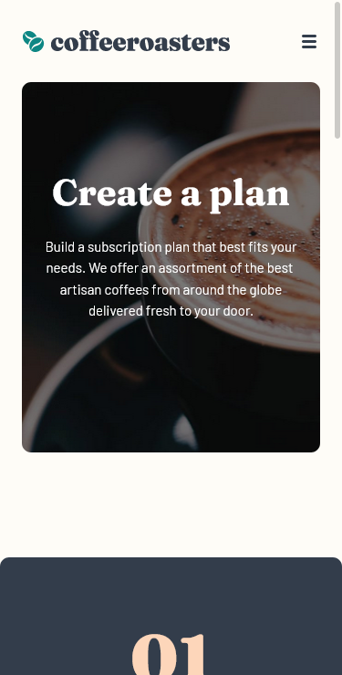
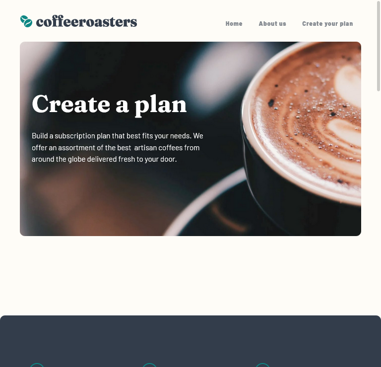
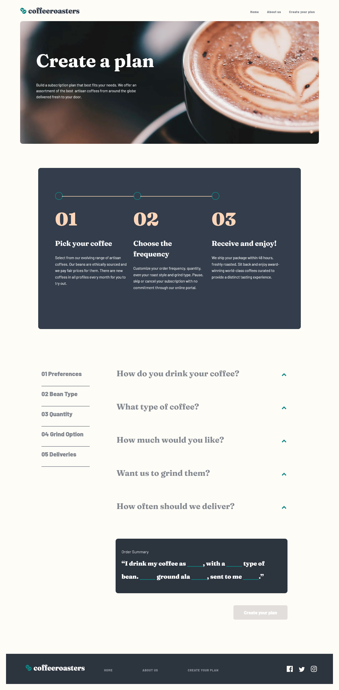

# Frontend Mentor - Coffeeroasters subscription site solution

This is a solution to the [Coffeeroasters subscription site challenge on Frontend Mentor](https://www.frontendmentor.io/challenges/coffeeroasters-subscription-site-5Fc26HVY6). Frontend Mentor challenges help you improve your coding skills by building realistic projects. 

## Table of contents

- [Overview](#overview)
  - [The challenge](#the-challenge)
  - [Expected Behaviour](#expected-behaviour)
  - [Screenshot](#screenshot)
  - [Links](#links)
- [My process](#my-process)
  - [Built with](#built-with)
  - [What I learned](#what-i-learned)
  - [Continued development](#continued-development)
  - [Useful resources](#useful-resources)
- [Author](#author)
- [Acknowledgments](#acknowledgments)


## Overview

### The challenge

Users should be able to:

- View the optimal layout for each page depending on their device's screen size
- See hover states for all interactive elements throughout the site
- Make selections to create a coffee subscription and see an order summary modal of their choices

### Expected bahaviour

The interactive subscription page has a number of specific behaviours, which are listed below:

- If "Capsule" is selected for the first option
  - The "Want us to grind them?" section should be disabled and not able to be opened
- Order summary texts updates
  - If "Capsule" is selected, update the order summary text to:
    - "I drink my coffee **using** Capsules"
    - Remove the grind selection text
  - If "Filter" or "Espresso" are selected, update the order summary text to:
    - "I drink my coffee **as** Filter||Espresso"
    - Keep/Add the grind selection text
  - For all other selections, add the selection title in the blank space where appropriate
- Updating per shipment price (shown in "How often should we deliver?" section at the bottom) based on weight selected
  - If 250g weight is selected
    - Every Week price per shipment is $7.20
    - Every 2 Weeks price per shipment is $9.60
    - Every Month price per shipment is $12.00
  - If 500g weight is selected
    - Every Week price per shipment is $13.00
    - Every 2 Weeks price per shipment is $17.50
    - Every Month price per shipment is $22.00
  - If 1000g weight is selected
    - Every Week price per shipment is $22.00
    - Every 2 Weeks price per shipment is $32.00
    - Every Month price per shipment is $42.00
- Calculating per month cost for the Order Summary modal
  - If Every Week is selected, the Order Summary modal should show the per shipment price multiplied by 4. For example, if 250g weight is selected, the price would be $28.80/month
  - If Every 2 Weeks is selected, the Order Summary modal should show the per shipment price multiplied by 2. For example, if 250g weight is selected, the price would be $19.20/month
  - If Every Month is selected, the Order Summary modal should show the per shipment price multiplied by 1. For example, if 250g weight is selected, the price would be $12.00/month

### Screenshot






### Links

- Live Site URL: [coffeeroasters live](https://chamumutezva.github.io/sunnyside-agency-landing-page-main/)

## My process

### Built with
- [React](https://reactjs.org/) - JS library
- React hooks
- React-router-dom - for page navigation
- Semantic HTML5 markup
- [sass](https://medium.com/nerd-for-tech/add-sass-to-your-react-app-in-2021-here-is-how-c7260c323a5a) setting up instruction
- [parceljs](https://parceljs.org/) for sass compiling
- Flexbox
- CSS Grid
- Mobile-first workflow


### What I learned

formatting a string into currency
**Intl.NumberFormat**
```
create number formatter
const formatter = new Intl.NumberFormat("en-US", {
  style: 'currency',
  currency: 'USD',
})
//USAGE
formatter.format(2500); //result $2, 500.00
```

If you want more help with writing markdown, we'd recommend checking out [The Markdown Guide](https://www.markdownguide.org/) to learn more.


### Continued development

- mobile navigation, it is not closing when a selection has been made . Has to be closed by pressing the close button again


### Useful resources

- [React router dom](https://reactrouter.com/web/guides/quick-start) - navigation between pages
- [bootstrap accordion](https://getbootstrap.com/docs/5.0/components/accordion/)
- [w3 - accessible accordion](https://www.w3.org/TR/wai-aria-practices-1.1/examples/accordion/accordion.html)

## Author

- Website - [Chamu Mutezva](https://github.com/ChamuMutezva)
- Frontend Mentor - [@ChamuMutezva](https://www.frontendmentor.io/profile/ChamuMutezva)
- Twitter - [@ChamuMutezva](https://twitter.com/ChamuMutezva)

## Acknowledgments

- Frontend Mentor community leaders for providing a platform to engage with fellow learners and mentors. This makes the learning exciting.
